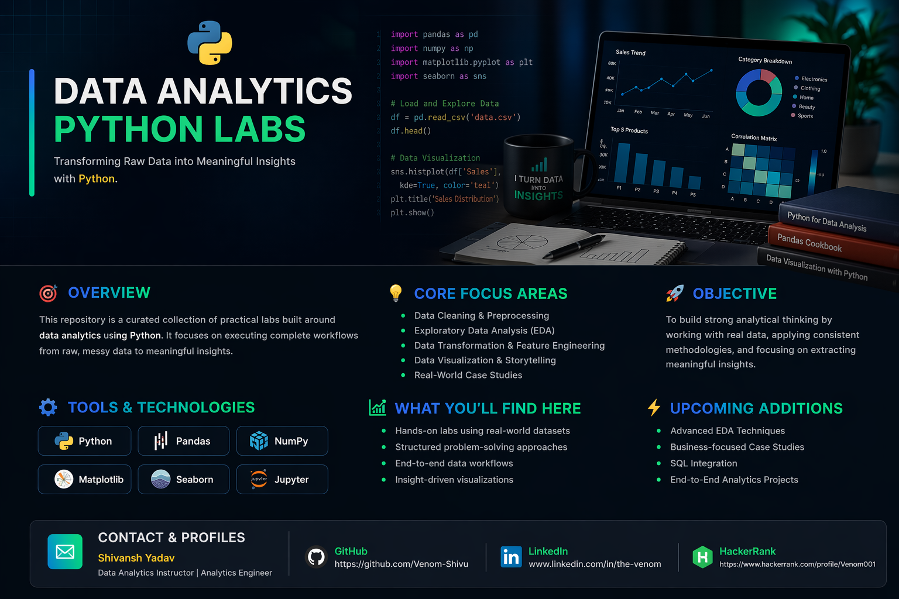

  

---

## 🚀 Overview

This repository is a curated collection of practical labs built around **data analytics using Python**.
It focuses on executing complete workflows — from raw, messy data to meaningful insights.

---

## 🧠 Core Focus Areas

* Data Cleaning & Preprocessing
* Exploratory Data Analysis (EDA)
* Data Transformation & Feature Engineering
* Data Visualization & Storytelling
* Real-World Case Studies

---

## 🛠️ Tools & Technologies

  
  
  
  
  
  

---

## 📈 What You’ll Find Here

* Hands-on labs using real-world datasets
* Structured problem-solving approaches
* End-to-end data workflows
* Insight-driven visualizations

---

## 🎯 Objective

To build strong analytical thinking by working with real data, applying consistent methodologies, and focusing on extracting meaningful insights.

---

## 🔥 Upcoming Additions

* Advanced EDA techniques
* Business-focused case studies
* SQL integration
* End-to-end analytics projects

---

## 📬 Contact & Profiles 

  <b>Shivansh Yadav</b> 
  Data Analytics Instructor | Analytics Engineer

<table align="center">
  <tr>
    <td align="center">
      
    </td>
    <td align="center">
      
    </td>
    <td align="center">
      
    </td>
  </tr>
</table>

---
